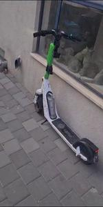
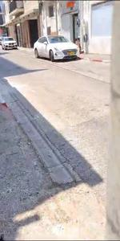
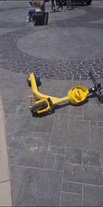
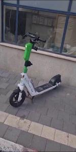

# Scooter Parking Classification Project
###  Dar Shabi, Dan Lellouche, Marc Levinson
## Description

This project is focused on classifying images of parked scooters into four categories:

0: Scooter parked properly\
1: No scooter\
2: Scooter not parked upright\
3: Scooter blocks footpath
 
<figure>
  <figcaption><b>Label 0: Scooter parked properly</b></figcaption>
  
</figure>
 
<figure>
  <figcaption><b>Label 1: No scooter</b></figcaption>
  
</figure>
 
<figure>
  <figcaption><b>Label 2: Scooter not parked upright</b></figcaption>
  
</figure>
 
<figure>
  <figcaption><b>Label 3: Scooter blocks footpath</b></figcaption>
  
</figure>
 

 
The business problem we're addressing is the misuse of the check-out system in shared scooter services. Currently, users are required to take a picture at the end of their ride to check out, presumably to ensure the scooter isn't damaged and is parked properly. However, these images are often not analyzed, leading to users frequently submitting irrelevant images. This system fails to achieve its purpose and can result in scooters being improperly parked or even damaged without accountability.

By developing a model that can accurately classify the state of the parked scooter in real-time, we aim to ensure proper usage and parking of shared scooters, helping city planners and transportation companies manage these services more effectively.

## Data Collection and Organization

Our team manually collected and labeled all the images used in this project. The images were obtained from various city locations at different times of the day, providing us with a diverse dataset.

The dataset was organized into four categories (as mentioned above) and stored on Google Drive. Google Drive proved to be a valuable tool for this project because it facilitated efficient collaboration among the team members, especially in conjunction with Google Colab for coding.

The data was split into a training set and a validation set to develop and fine-tune our models.

## Model Development

Our model builds upon the pre-trained VGG16 model, utilizing transfer learning to leverage the learned features from a large dataset and apply them to our specific task.

We used Keras, a high-level neural networks API, written in Python and capable of running on top of TensorFlow. Our code loads the images from the directories, preprocesses them, and feeds them into the model.

We used Keras's ImageDataGenerator to create a pipeline for feeding the images into our model. This allowed us to perform real-time data augmentation and preprocessing, which can help improve the model's performance by presenting it with a more diverse set of training examples.

## Experiments and Findings

Several experiments were carried out in order to enhance the model's performance. These include:

**Implementing augmentation on the fly:** We created an image augmentation function to produce additional training examples by flipping, shearing, and adjusting the brightness of the original images. However, the augmentation did not lead to an improvement in model performance and was hence not used in the final model.\
**Edge Detection:** We experimented with edge detection as a means of feature extraction. Different kernel values and thresholds were used for the magnitude of edge detection, but this approach did not yield an improvement in model performance.
Our final model, without augmentation and edge detection, was found to deliver the best performance in terms of classification accuracy.

## Results

Our final model achieved an overall accuracy of 80% on the test set. The precision, recall, and F1-score for each class are summarized as follows:
 
 

 
 
The results indicate that the model performed well in identifying the presence of a scooter and its upright status. However, it appears to struggle somewhat in differentiating between correctly and poorly parked scooters.
The confusion matrix provided gives us more insight:
 
 

 
 
From the matrix, we can see that the most common confusion occurs between correctly parked scooters (Label 0) and scooters blocking footpaths (Label 3), where reletivly high percetage of the instances of scooters blocking the footpath were misclassified as correctly parked scooters. 

## Application Development

To demonstrate the usability of our model, we developed an application using Streamlit. In this application, users can upload an image and receive an instant prediction of its classification category. 
 
[Try our app](http://3.71.16.175:8501/)

## Future Work

Future enhancements should consider additional data collection, refining our labeling system and methodology to reduce subjectivity between labels, particularly between 'correctly parked' and 'blocking footpath'. Exploring more advanced model architectures and hyperparameter tuning could further elevate the model's performance.

<footer>
  
&copy; 2023 Dar Shabi, Dan Lellouche, and Marc Levinson. All rights reserved.

</footer>
